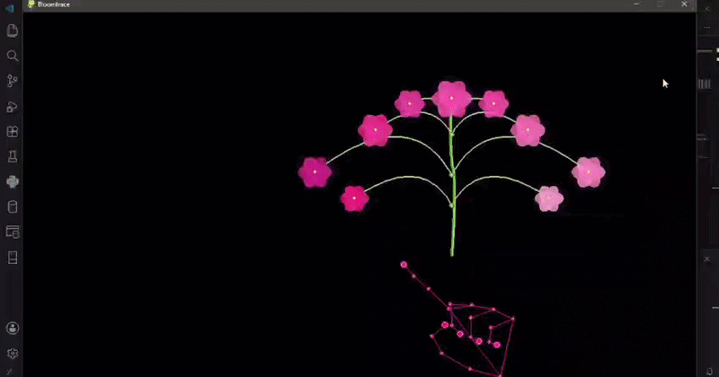

# Bloomtrace

*A digital bouquet that blooms with your hand.*

## About the Project

Bloomtrace started as a simple question:

> What if hand tracking didn't just draw dots and skeleton lines on a screen, but actually grew something?

I wanted to learn computer vision by building something interactive and visually engaging rather than following a standard hand-tracking tutorial. Tracking a hand felt technical on its own, so I paired it with something organic: a bouquet that follows your hand and blooms the moment you open your palm.

The result is a small experiment that combines computer vision, animation, and design to turn movement into something that feels alive.

---

## Features

*  Real-time hand tracking through a webcam
*  Bouquet follows your index finger
*  Open-palm gesture triggers a bloom animation
*  Detects hand state using thumb-to-pinky distance
*  Soft glowing petals with bloom effects
*  Curved stems rendered using Bézier curves
*  Neon hand landmark visualization
*  Keyboard controls for testing without a camera

---

## How It Works

1. OpenCV captures live webcam frames.
2. MediaPipe detects and tracks hand landmarks.
3. The index finger controls the bouquet's position.
4. The distance between the thumb and pinky determines whether the hand is open or closed.
5. When an open hand is detected, all flowers bloom simultaneously.
6. Pygame handles rendering, animations, glow effects, and stem drawing.

---

## Technical Highlights

Instead of relying on pre-made assets, most visual elements are generated programmatically:

* Petals are created using rotated ellipses and trigonometry.
* Flower blooms are animated using custom interpolation logic.
* Stems are rendered with quadratic Bézier curves.
* Gesture recognition is implemented using landmark distance calculations.
* Glow effects are layered using alpha-blended surfaces.

This approach made development more challenging, but it also provided a deeper understanding of the mathematics and rendering techniques behind the visuals.

---

## Tech Stack

* Python
* Pygame
* OpenCV
* MediaPipe

---

## Installation

Clone the repository:

```bash
git clone <your-repository-url>
cd Bloomtrace
```

Install dependencies:

```bash
pip install pygame opencv-python mediapipe
```

Run the project:

```bash
python main.py
```

---

## Controls

### Keyboard Controls

| Key   | Action                 |
| ----- | ---------------------- |
| W     | Move bouquet up        |
| A     | Move bouquet left      |
| S     | Move bouquet down      |
| D     | Move bouquet right     |
| Space | Toggle bloom animation |

### Hand Gestures

| Gesture           | Action            |
| ----------------- | ----------------- |
| Open Palm         | Bloom all flowers |
| Move Index Finger | Move bouquet      |
| Close Palm        | close all flowers |
---

## Project Structure

```text
Bloomtrace/
│
├── main.py
├── flower.py
├── README.md
└── assets/
    └── bloomtrace-demo.gif
```

---

## Future Improvements

* Additional flower styles
* More gesture interactions
* Particle effects
* Custom color palettes
* Performance optimizations
* Multi-hand support

---

## Demo

Add a GIF or video demonstration here.

Example:



---

## Author

**Haadiya Farhan**

Financial Technology student interested in software development, computer vision, and interactive creative coding.

GitHub: https://github.com/coldbrew-dat

LinkedIn: https://linkedin.com/in/haadiya-farhan-0155a328b
